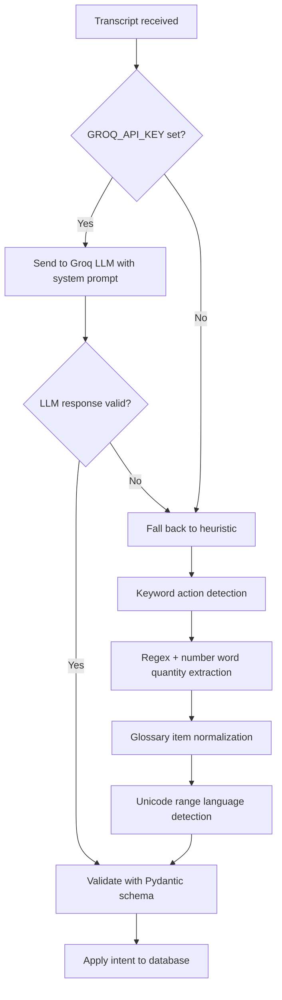
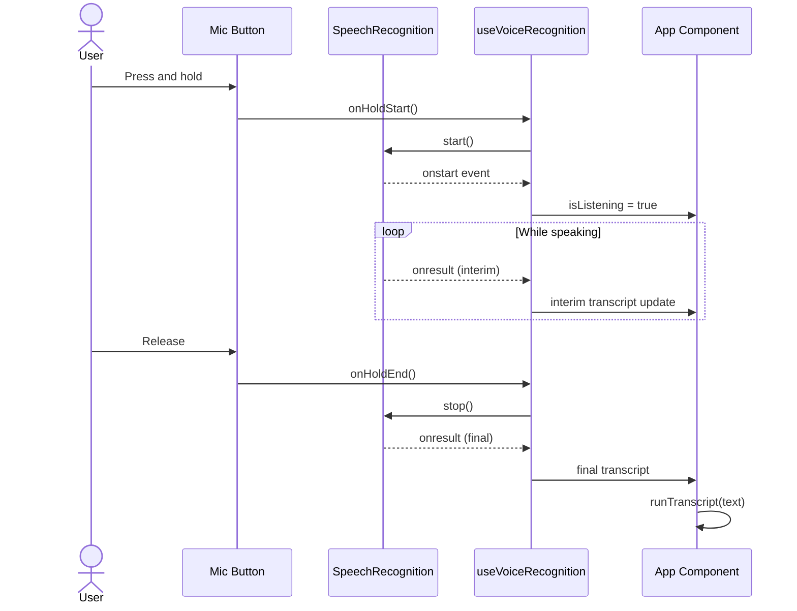
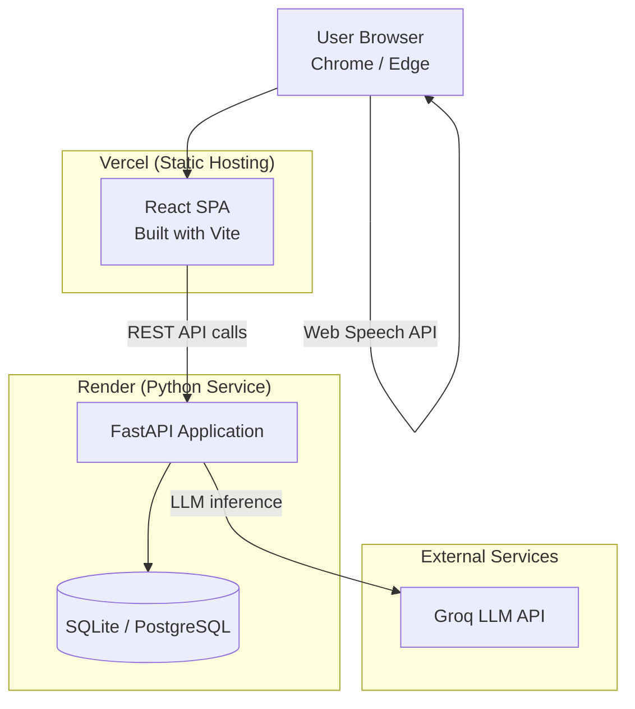
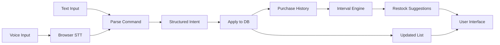

# SmartCart AI -- Technical Documentation

This document provides detailed technical documentation for developers who want to understand, modify, or extend the SmartCart AI application.

---

## Table of Contents

- [Project Structure](#project-structure)
- [API Endpoint Reference](#api-endpoint-reference)
- [Database Schema](#database-schema)
- [NLP Pipeline](#nlp-pipeline)
- [Voice Recognition Flow](#voice-recognition-flow)
- [Suggestion Algorithm](#suggestion-algorithm)
- [Substitute Mapping](#substitute-mapping)
- [Configuration](#configuration)
- [Architecture Diagrams](#architecture-diagrams)

---

## Project Structure

```
smartcart-ai/
├── backend/
│   ├── app/
│   │   ├── __init__.py
│   │   ├── config.py          # Environment configuration (Pydantic Settings)
│   │   ├── crud.py            # Database CRUD operations and intent application
│   │   ├── database.py        # SQLAlchemy engine and session management
│   │   ├── main.py            # FastAPI application entry point and route handlers
│   │   ├── models.py          # SQLAlchemy ORM models
│   │   ├── nlp.py             # LLM and heuristic intent parsing
│   │   ├── schemas.py         # Pydantic request/response schemas
│   │   ├── seed.py            # Purchase history seed data
│   │   ├── substitutes.py     # Static substitute item mapping
│   │   └── suggestions.py     # pandas-based restock suggestion engine
│   ├── requirements.txt
│   ├── render.yaml
│   └── .env.example
├── frontend/
│   ├── src/
│   │   ├── App.tsx            # Main application component
│   │   ├── api.ts             # HTTP client for backend communication
│   │   ├── types.ts           # TypeScript type definitions and constants
│   │   ├── index.css          # Global styles and design tokens
│   │   ├── main.tsx           # React DOM entry point
│   │   ├── hooks/
│   │   │   └── useVoiceRecognition.ts  # Web Speech API integration hook
│   │   └── components/
│   │       ├── LanguageSelect.tsx      # Language picker UI
│   │       ├── ShoppingList.tsx        # Cart-style item list
│   │       ├── SuggestionsPanel.tsx    # Restock suggestion cards
│   │       ├── Toasts.tsx             # Notification system
│   │       └── VoiceDock.tsx          # Microphone button and status
│   ├── index.html
│   ├── package.json
│   ├── vite.config.ts
│   └── vercel.json
├── docs/
│   ├── architecture.puml
│   └── class-diagram.puml
├── README.md
├── IMPLEMENTATION.md
├── DOCUMENTATION.md
└── LICENSE
```

---

## API Endpoint Reference

All endpoints accept and return JSON. The base URL defaults to `http://127.0.0.1:8001` in local development.

### GET /health

Returns the service health status and whether the LLM is configured.

**Response:**
```json
{
  "status": "ok",
  "llm": true,
  "db": "sqlite"
}
```

| Field | Type | Description |
| --- | --- | --- |
| `status` | string | Always "ok" if the service is running. |
| `llm` | boolean | `true` if GROQ_API_KEY is set. |
| `db` | string | Database engine type. |

---

### POST /parse-command

Parse a voice transcript into a structured intent and apply it to the shopping list.

**Request:**
```json
{
  "transcript": "add two bananas",
  "language_hint": "en-IN"
}
```

| Field | Type | Required | Description |
| --- | --- | --- | --- |
| `transcript` | string | Yes | The speech transcript to parse. 1-500 characters. |
| `language_hint` | string | No | ISO locale code hint (e.g., "en-IN", "hi-IN", "te-IN"). |

**Response:**
```json
{
  "intent": {
    "action": "add",
    "item": "bananas",
    "quantity": 2,
    "category": "produce",
    "original_language": "en",
    "confidence": 0.95,
    "notes": "User wants to add 2 bananas"
  },
  "transcript": "add two bananas",
  "applied": true,
  "message": "Added 2x bananas",
  "items": [],
  "parser": "llm"
}
```

---

### GET /items

Retrieve all items currently on the shopping list, ordered by most recently added.

**Response:**
```json
[
  {
    "id": "a1b2c3d4-...",
    "item": "milk",
    "quantity": 1,
    "category": "dairy",
    "added_at": "2025-08-25T10:30:00Z"
  }
]
```

---

### POST /items

Add a new item to the shopping list. If the item already exists, its quantity is incremented.

**Request:**
```json
{
  "item": "eggs",
  "quantity": 6,
  "category": "dairy"
}
```

---

### PATCH /items/{id}

Update an existing item's quantity, category, or name.

**Request:**
```json
{
  "quantity": 3
}
```

All fields are optional. Only provided fields are updated.

---

### DELETE /items/{id}

Remove an item from the shopping list.

**Response:**
```json
{
  "ok": true
}
```

---

### POST /items/{id}/complete

Mark an item as purchased. This archives the item into `purchase_history` and removes it from the active list. The archived record is used for future restock suggestions.

**Response:**
```json
{
  "ok": true,
  "message": "Marked milk as purchased",
  "items": []
}
```

---

### GET /suggestions

Get computed restock suggestions based on purchase history analysis.

**Response:**
```json
{
  "suggestions": [
    {
      "item": "milk",
      "category": "dairy",
      "reason": "Usually bought every 7 days; last purchase was 6 days ago",
      "avg_interval_days": 7.0,
      "days_since_last": 6.0,
      "purchase_count": 4,
      "substitutes": ["almond milk", "soy milk", "oat milk"]
    }
  ],
  "method": "frequency-interval"
}
```

---

### GET /substitutes/{item}

Get substitute items for a specific product.

**Response:**
```json
{
  "item": "milk",
  "substitutes": ["almond milk", "soy milk", "oat milk"]
}
```

---

## Database Schema

The application uses two tables. SQLAlchemy creates them automatically on startup.

### list_items

Stores the current shopping list.

| Column | Type | Constraints | Description |
| --- | --- | --- | --- |
| id | UUID | Primary key, auto-generated | Unique identifier. |
| item | VARCHAR | Not null | Item name, normalized to lowercase. |
| quantity | INTEGER | Default 1 | Number of units. |
| category | VARCHAR | | Item category (dairy, produce, etc.). |
| added_at | DATETIME | Default current timestamp | When the item was added. |

### purchase_history

Stores completed (purchased) items for suggestion computation.

| Column | Type | Constraints | Description |
| --- | --- | --- | --- |
| id | UUID | Primary key, auto-generated | Unique identifier. |
| item | VARCHAR | Not null | Item name. |
| category | VARCHAR | | Item category. |
| quantity | INTEGER | Default 1 | Number of units purchased. |
| purchased_at | DATETIME | Default current timestamp | When the item was marked as purchased. |

### SQL Definition

```sql
CREATE TABLE list_items (
    id UUID PRIMARY KEY DEFAULT gen_random_uuid(),
    item TEXT NOT NULL,
    quantity INTEGER DEFAULT 1,
    category TEXT,
    added_at TIMESTAMPTZ DEFAULT NOW()
);

CREATE TABLE purchase_history (
    id UUID PRIMARY KEY DEFAULT gen_random_uuid(),
    item TEXT NOT NULL,
    category TEXT,
    quantity INTEGER DEFAULT 1,
    purchased_at TIMESTAMPTZ DEFAULT NOW()
);
```

---

## NLP Pipeline

The NLP system has two paths: the primary LLM path and the heuristic fallback.

### LLM Path

When a Groq API key is configured, the transcript is sent to the Llama 3.3 70B model with a system prompt that instructs it to return a strict JSON intent object. The system prompt includes:

- The list of valid actions (add, remove, modify, search, complete)
- Instructions for normalizing multilingual item names to English
- Rules for parsing quantities from spoken number words in Hindi, Telugu, and English
- Category classification guidelines

The model returns structured JSON which is validated through a Pydantic schema with coercion validators that handle edge cases (for example, clamping quantity to a minimum of 1).

### Heuristic Path

When no API key is available, the heuristic parser uses:

1. **Keyword matching** for action detection (for example, "remove," "delete," "hatado," "teeseyyi" all map to the remove action).
2. **Regex and number word lookup** for quantity extraction (supporting English, Hindi, and Telugu number words).
3. **A bilingual glossary** for item normalization (for example, mapping Telugu "paalu" or "biyyam" to "milk" or "rice").
4. **Unicode range detection** for language identification (Devanagari for Hindi, Telugu script range for Telugu).

### Pipeline Flow



---

## Voice Recognition Flow

Voice recognition is handled entirely in the browser using the Web Speech API.

### Supported Locales

| Locale Code | Language | Speech Recognition | NLP Support |
| --- | --- | --- | --- |
| en-IN | English (India) | Native | Full |
| hi-IN | Hindi (India) | Native | Full (LLM) / Glossary (heuristic) |
| te-IN | Telugu (India) | Native | Full (LLM) / Glossary (heuristic) |

### Browser Compatibility

The Web Speech API (`webkitSpeechRecognition`) is supported in Chromium-based browsers (Chrome, Edge, Opera). Safari and Firefox do not support it. The application detects support at runtime and disables the microphone button if unavailable. The text input fallback uses the same NLP pipeline and works on all browsers.

### Recognition Flow



---

## Suggestion Algorithm

The suggestion engine uses purchase history to compute personalized restock recommendations.

### Algorithm Steps

1. **Load history**: Query all `purchase_history` records, grouped by item name.
2. **Compute intervals**: For each item with two or more purchases, calculate the time differences between consecutive purchase dates.
3. **Calculate mean interval**: Compute the arithmetic mean of the inter-purchase intervals for each item.
4. **Calculate current gap**: Determine how many days have elapsed since the most recent purchase.
5. **Apply threshold**: An item is suggested for restocking if `current_gap >= 0.8 * mean_interval`.
6. **Rank**: Sort suggestions by how overdue they are relative to their expected interval.
7. **Attach substitutes**: Look up each suggested item in the substitute mapping table.

### Example

If milk has been purchased on days 0, 7, 14, 21, and 28:
- Intervals: [7, 7, 7, 7]
- Mean interval: 7.0 days
- Threshold: 7.0 * 0.8 = 5.6 days
- If current gap is 6 days, milk is suggested (6 >= 5.6)

### Minimum Data Requirements

- Items with fewer than 2 purchases do not have enough data to compute intervals.
- The seed data in `seed.py` provides realistic purchase patterns for common items so that the suggestions panel is populated on first boot.

---

## Substitute Mapping

Substitutes are defined in `backend/app/substitutes.py` as a static dictionary. Each key is an item name and the value is a list of alternative items.

Current mappings include:

| Item | Substitutes |
| --- | --- |
| milk | almond milk, soy milk, oat milk |
| butter | margarine, ghee, olive oil |
| eggs | flax eggs, tofu, applesauce |
| sugar | jaggery, stevia, honey |
| rice | quinoa, couscous, millet |
| bread | tortillas, naan, rice cakes |
| onion | shallots, leeks, chives |
| potato | sweet potato, turnip, cauliflower |

---

## Configuration

Configuration is managed through environment variables, loaded via Pydantic Settings from a `.env` file.

| Variable | Default | Description |
| --- | --- | --- |
| `GROQ_API_KEY` | (empty) | Groq API key for LLM parsing. Optional; heuristic fallback is used when not set. |
| `GROQ_MODEL` | `llama-3.3-70b-versatile` | The Groq model identifier. |
| `DATABASE_URL` | `sqlite:///./voice_shop.db` | SQLAlchemy database connection string. Set to a PostgreSQL URL for production. |
| `CORS_ORIGINS` | `http://localhost:5173,...` | Comma-separated list of allowed CORS origins. |
| `VITE_API_URL` | (empty) | Frontend environment variable pointing to the backend URL. |

---

## Architecture Diagrams

### Deployment View



### Data Flow


