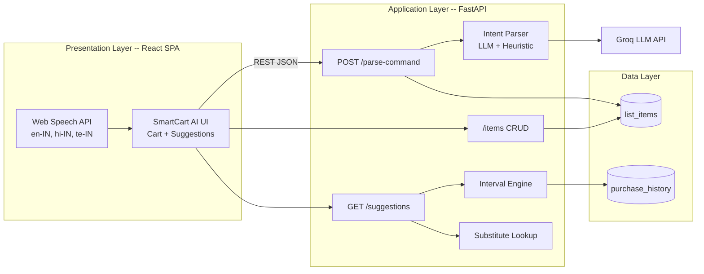
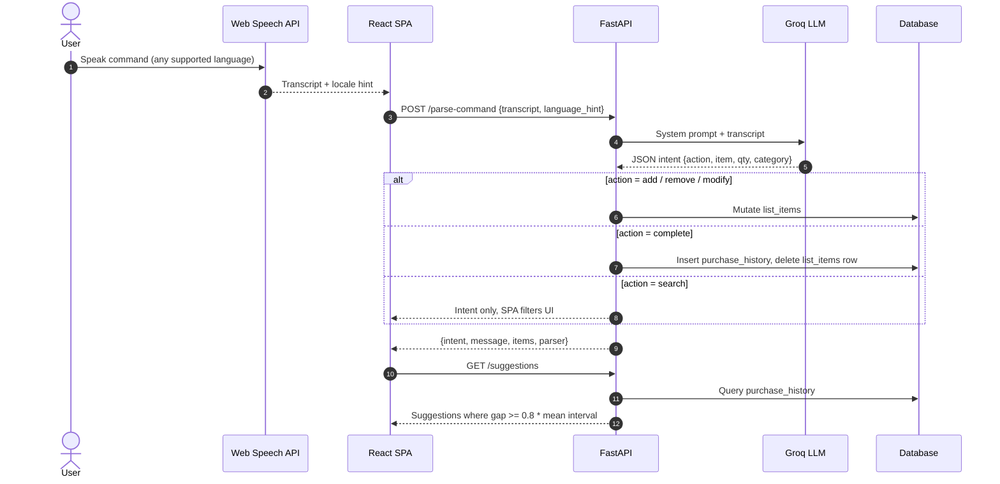
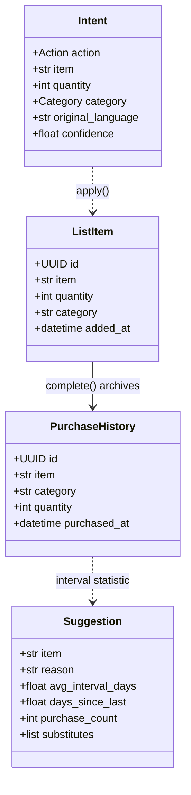
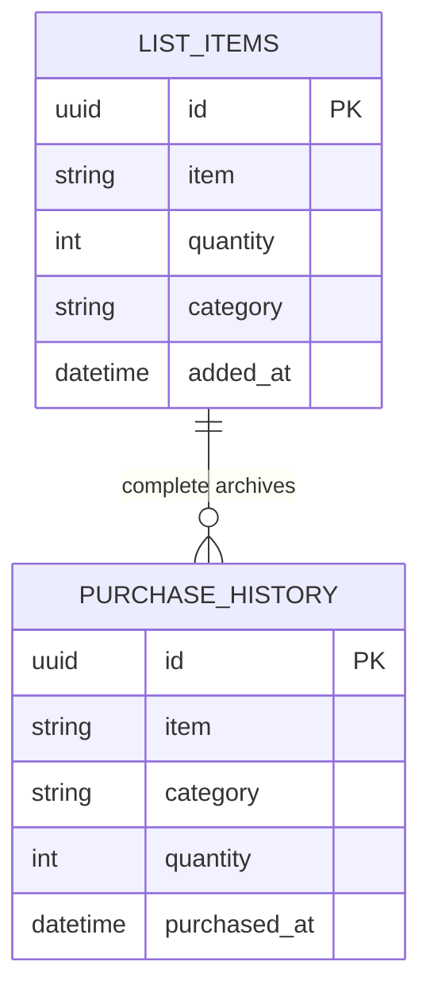

# SmartCart AI

A voice-powered multilingual grocery shopping assistant that understands natural language commands in English, Hindi, and Telugu, manages a categorized shopping list, and generates smart restock suggestions based on purchase history analysis.

[](LICENSE)
[](backend/requirements.txt)
[](backend)
[](frontend)
[](frontend)
[](frontend)
[](frontend)
[](#contributing)

> **Live demo:** _Deploy on Vercel + Render (see [Deployment](#deployment))_
> **GitHub:** [BodanampatiMohith/Smart-voicecart-AI](https://github.com/BodanampatiMohith/Smart-voicecart-AI)
> **Voice input:** Chrome or Edge required (Web Speech API). Text input works on all browsers.

---

## Table of Contents

- [Overview](#overview)
- [Features](#features)
- [Architecture](#architecture)
- [Tech Stack](#tech-stack)
- [Local Setup](#local-setup)
- [API Reference](#api-reference)
- [Deployment](#deployment)
- [Assessment Write-Up](#assessment-write-up)
- [Known Limitations](#known-limitations)
- [Future Work](#future-work)
- [Issue Labels](#issue-labels)
- [Contributing](#contributing)
- [License](#license)

---

## Overview

SmartCart AI addresses the gap between traditional text-based shopping lists and the natural way people think about groceries. Users speak in their preferred language, and the system translates that intent into structured actions on a shared shopping list.

The application pipeline works as follows:

1. The browser transcribes speech using the Web Speech API in the selected locale.
2. The backend parses the transcript into a structured intent (action, item, quantity, category) using either an LLM or a heuristic fallback.
3. The intent is applied to the shopping list database.
4. Smart suggestions are computed from the user's purchase history using statistical interval analysis.

---

## Features

### Voice Input

- **Speech recognition** via the Web Speech API with locale selection (English, Hindi, Telugu).
- **Natural language processing** that understands varied phrasing across languages. "Add milk," "doodh chahiye," and "paalu kavali" all resolve to the same item.
- **Heuristic fallback** when the LLM is unavailable, ensuring the application remains functional without an API key.

### Smart Suggestions

- **Purchase interval analysis** computes the average time between purchases for each item and surfaces restock alerts when the current gap exceeds 80% of the historical mean.
- **Substitute recommendations** offer alternatives when items are added (for example, almond milk, soy milk, or oat milk when adding milk). These are from a curated lookup table, not a black-box model.

### Shopping List Management

- **Full CRUD operations** via voice or typed commands: add, remove, modify quantities, search, and mark as purchased.
- **Automatic categorization** into dairy, produce, snacks, grains, household, or other.
- **Quantity parsing** from natural language, including Hindi and Telugu number words.

### User Interface

- Clean, warm e-commerce design with responsive layout.
- Real-time visual feedback for voice recognition and command processing.
- Category filtering, quantity steppers, and cart-style item management.
- Scrolling marquee banner for contextual information.

---

## Architecture

### System Component Diagram



### Sequence Diagram -- Voice Command Flow



### Class Diagram



### Entity-Relationship Diagram



PlantUML source files are available in the `docs/` directory for offline rendering.

---

## Tech Stack

| Layer | Technology | Rationale |
| --- | --- | --- |
| Frontend | React 19, Vite, TypeScript, Tailwind CSS v4 | Modern SPA stack with strong typing and fast builds. |
| Voice | Web Speech API | Zero-cost browser-native STT with built-in locale support. No API key required. |
| NLP | Groq (Llama 3.3 70B) | Low-latency structured JSON extraction across Hindi, Telugu, and English. Falls back to a heuristic parser if unavailable. |
| Backend | FastAPI (Python) | Typed Pydantic contracts, async-ready, and same language as the suggestion engine. |
| Suggestions | pandas | Statistical interval computation on purchase history. |
| Database | SQLite (default), PostgreSQL (configurable) | Zero-config local development with production-ready upgrade path. |
| Hosting | Vercel (frontend), Render (backend) | Separated concerns with independent scaling. |

---

## Local Setup

### Prerequisites

- Node.js 20 or later
- Python 3.11 or later
- Chrome or Edge browser (for voice input)

### Backend

```bash
cd backend
python -m venv venv

# Windows
venv\Scripts\activate

# macOS / Linux
source venv/bin/activate

pip install -r requirements.txt
copy .env.example .env   # Windows
# cp .env.example .env   # macOS / Linux
```

Edit `.env` to add your Groq API key (optional; the app works without it using the heuristic parser):

```
GROQ_API_KEY=gsk_your_key_here
```

Start the backend:

```bash
uvicorn app.main:app --reload --port 8001
```

### Frontend

```bash
cd frontend
npm install
```

Create `.env` with the backend URL:

```
VITE_API_URL=http://127.0.0.1:8001
```

Start the development server:

```bash
npm run dev
```

Open `http://localhost:5173` in Chrome or Edge. The application seeds sample purchase history on first boot so that the suggestions panel is populated immediately.

---

## API Reference

| Method | Endpoint | Description |
| --- | --- | --- |
| `GET` | `/health` | Service health check. Returns LLM availability status. |
| `POST` | `/parse-command` | Parse a voice transcript into a structured intent and apply it. |
| `GET` | `/items` | Retrieve all items on the shopping list. |
| `POST` | `/items` | Add a new item to the shopping list. |
| `PATCH` | `/items/{id}` | Update an existing item (quantity, category, name). |
| `DELETE` | `/items/{id}` | Remove an item from the shopping list. |
| `POST` | `/items/{id}/complete` | Mark an item as purchased (archives to history). |
| `GET` | `/suggestions` | Get computed restock suggestions with substitutes. |
| `GET` | `/substitutes/{item}` | Get substitute items for a specific product. |

Full OpenAPI documentation is available at `/docs` when the backend is running.

---

## Deployment

### Backend (Render)

1. Set the root directory to `backend`.
2. Build command: `pip install -r requirements.txt`
3. Start command: `uvicorn app.main:app --host 0.0.0.0 --port $PORT`
4. Environment variables: `GROQ_API_KEY`, `CORS_ORIGINS` (set to your Vercel domain).

### Frontend (Vercel)

1. Set the root directory to `frontend`.
2. Environment variable: `VITE_API_URL` (set to your Render backend URL, no trailing slash).
3. Redeploy after setting the variable.

Note: Render free tier instances spin down after inactivity. The first request after idle may take 30 to 60 seconds.

---

## Assessment Write-Up

The core loop is browser transcription to FastAPI to structured JSON intent to database mutation. Under an eight-hour cap, the investment went into two differentiators most demos skip: multilingual STT (Hindi and Telugu locale codes with LLM normalization to English item names) and computed restock logic (per-item mean inter-purchase gap, surfaced when the current gap reaches 80% of that mean). Substitutes are a static dictionary and are documented as such. Authentication, price filtering, and WebSockets were deferred so the hosted URL survives a first voice command rather than showcasing incomplete ambition. The architectural choice was a two-service React plus FastAPI deployment versus a Next.js monolith; the split was kept because it matches common production patterns and exercises both deployment targets. If the Groq key is absent, a heuristic parser still mutates the list, so the UI never depends on the LLM being available.

---

## Known Limitations

- **Web Speech API** is Chromium-only. Safari and Firefox users get the text input fallback but not the microphone.
- **Render free tier** spins down after inactivity. The first request after idle is slow. This is a hosting tier constraint, not an application bug.
- **STT accuracy** varies with ambient noise and accent. The LLM cannot recover a garbled transcript.
- **Heuristic parser** handles English well but relies on a glossary for Hindi and Telugu. The LLM provides significantly better multilingual results.
- **Substitutes** are a static lookup table by design, not a trained recommendation model.
- **Single shared list** with no authentication. Multi-user support would require auth integration.

---

## Future Work

| Feature | Description |
| --- | --- |
| Price-range voice filters | Requires a product catalog with pricing data. |
| Seasonal recommendations | Calendar-aware suggestions based on regional produce availability. |
| User authentication | OAuth integration for per-user lists and history. |
| WebSocket sync | Real-time multi-tab and multi-device list synchronization. |
| Offline mode | Service worker caching for voice commands when disconnected. |

---

## Issue Labels

These labels are intended for repository issue tracking and triage:

| Label | Color | Purpose |
| --- | --- | --- |
| `type:feature` | `#E8C547` | New capability or enhancement request. |
| `type:bug` | `#D73A4A` | Broken functionality or deployment issue. |
| `area:nlp` | `#0E8A16` | Prompt engineering, LLM integration, heuristic parser. |
| `area:voice` | `#1D76DB` | Speech recognition, locale handling. |
| `area:suggestions` | `#7057FF` | Interval engine, substitute mapping. |
| `area:ui` | `#F9D0C4` | Frontend design, responsive layout, accessibility. |
| `good first issue` | `#7F8C8D` | Documentation improvements, adding substitute entries, minor fixes. |
| `needs-api-key` | `#000000` | Issues reproducible only without the LLM API key. |

---

## Contributing

1. Fork the repository.
2. Create a feature branch from `main`.
3. Make changes and verify the build passes (`npm run build` in `frontend/`).
4. Submit a pull request with a clear description of the change.

---

## License

[MIT](LICENSE)
